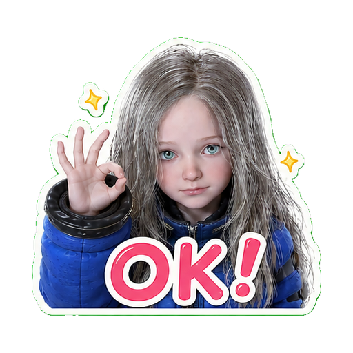
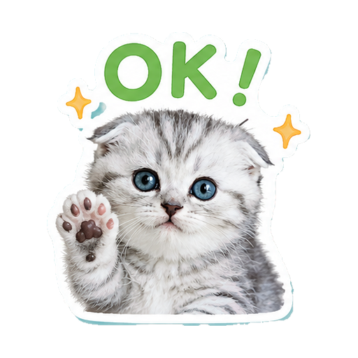
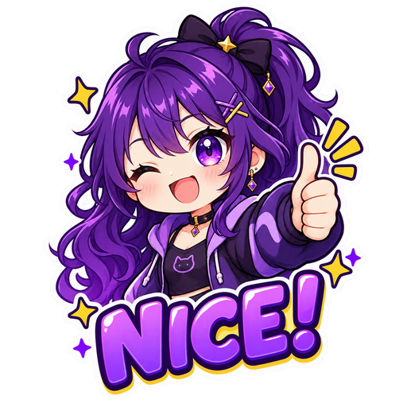
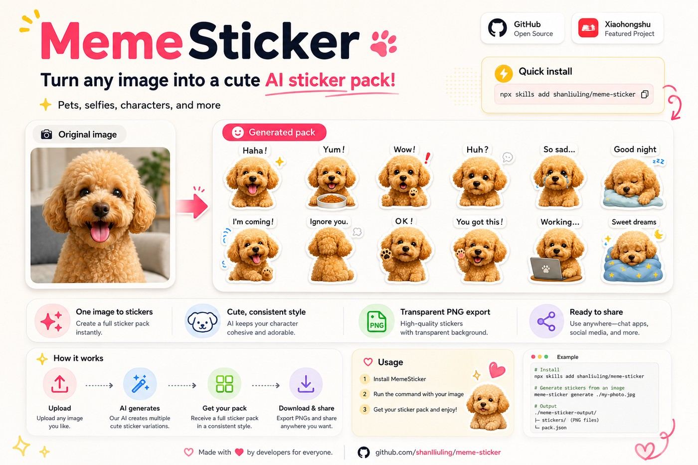

<div align="center">

# MemeSticker 🐾

<p>
  <a href="./assets/sticker-ok-selfie.png"></a>
  <a href="./assets/sticker-ok-cat.png"></a>
  <a href="./assets/sticker-nice-character.png"></a>
</p>

### One image → a full sticker pack.

**An open-source sticker-making Skill for any Agent — not tied to one model or platform.**

Generate the whole pack in one image call, then auto-split, remove backgrounds, and export transparent PNGs.

**One generation · Fewer credits · Auto split · Transparent PNG**

[](https://github.com/shanliuling/meme-sticker/stargazers)
[](./LICENSE)
[](https://www.python.org/)
[](https://linux.do/)

**English** · [简体中文](./README.zh-CN.md)

<br/>



</div>

---

## ✨ Why MemeSticker?

- **Agent-native** — install the Skill and reuse the same workflow across compatible Agents.
- **One call, full pack** — generate a complete sticker sheet instead of spending one image call per sticker.
- **Ready to use** — splitting, background removal, transparent PNG export, preview and ZIP are handled automatically.

---

## 🎬 Real outputs

<p align="center">
  <a href="./assets/example-girl.jpg"></a>
  <a href="./assets/example-cat.jpg"></a>
  <a href="./assets/example-character.jpg"></a>
</p>

<div align="center">

**Selfies · Pets · Characters · Toys · Mascots · Objects**

**Captions follow your language.**

</div>

---

## ⚡ Install and use

```bash
npx skills add shanliuling/meme-sticker
```

Upload an image, then simply say:

> **Turn this into a cute sticker pack.**

Or add the theme you want:

> Make a sarcastic reaction sticker pack from this character.

> Turn this pet photo into a work-chat meme pack.

The result includes a preview and `sticker-pack.zip`, containing individual transparent PNG stickers.

> [!IMPORTANT]
> The host must support Skills plus image generation or image editing, and provide Python 3.10+. The first run may need to install NumPy and Pillow.

> [!NOTE]
> Character consistency, generated text and complex-background handling depend on the host image model. Importing the PNGs into WhatsApp, Telegram or other messaging apps is handled separately.

## 📄 License

MIT © 2026 shanliuling
