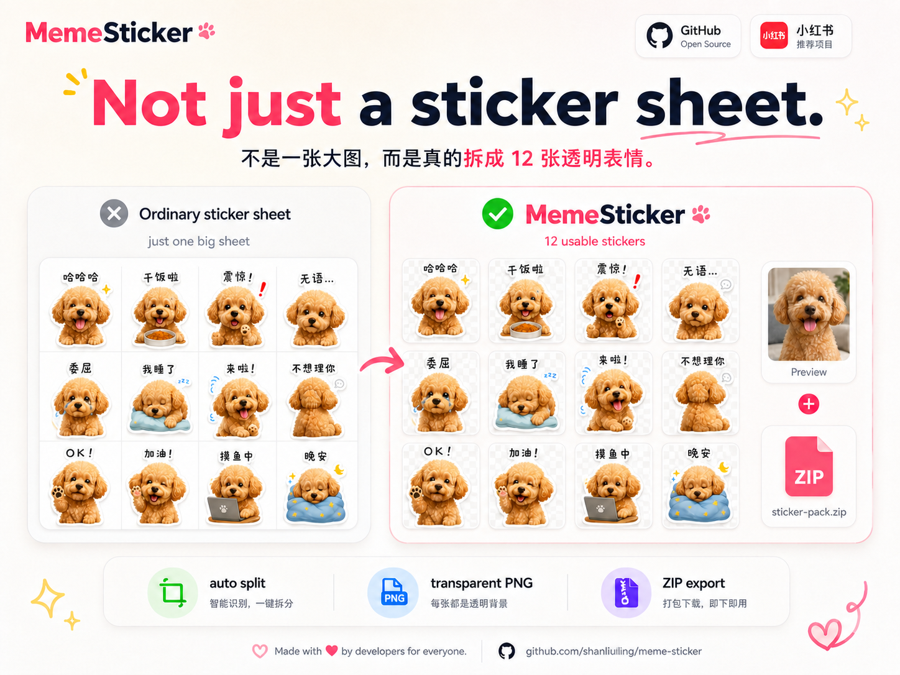
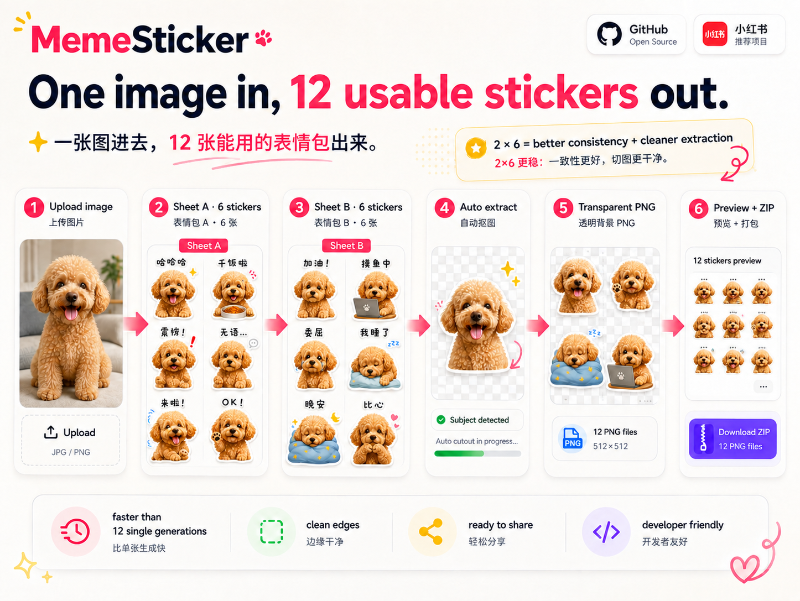

<div align="center">

# MemeSticker 🐾

### One image in, 12 usable stickers out.

**Turn pets, selfies, characters, toys — almost anything — into a complete AI chat sticker pack.**

一张图进去，12 张能用的表情包出来。

[](https://github.com/shanliuling/meme-sticker/stargazers)
[](./LICENSE)
[](https://www.python.org/)

**English** · [简体中文](./README.zh-CN.md)

<br/>


</div>

---

## ✨ Why MemeSticker?

AI can already generate a nice sticker sheet. The annoying part starts **after** that: cropping, removing backgrounds, cleaning color spill, resizing, and exporting every sticker one by one.

**MemeSticker does the whole production pipeline for you.**

| 🎨 Generate | ✂️ Split | 🪄 Clean | 📦 Pack |
| --- | --- | --- | --- |
| Reactions, captions and poses | Separate every sticker | Transparent background + edge cleanup | Preview + 12 PNGs + ZIP |

> **Not just a sticker sheet. You get 12 individual transparent PNGs that are actually usable.**

---

## 🎬 Real outputs

One skill, very different subjects:

<p align="center">
  <a href="./assets/example-girl.jpg"></a>
  <a href="./assets/example-cat.jpg"></a>
  <a href="./assets/example-character.jpg"></a>
</p>

<div align="center">

**Selfies · Pets · Characters · Toys · Mascots · Objects**

</div>

---

## ⚡ 30 seconds to start

```bash
npx skills add shanliuling/meme-sticker
```

Then upload an image and just say:

> **Turn this into a cute sticker pack.**

Or give it a theme:

> Make 12 sarcastic reaction stickers from this character.

> Turn this pet photo into a work-chat meme pack.

> 把这张图做成一套打工人表情包。

No need to write 12 prompts manually. MemeSticker plans the full set for you.

---

## 🔥 Not just a big sticker sheet

Most AI workflows stop at one big 12-grid image. MemeSticker keeps going: it extracts each sticker, removes the background, cleans the edges, normalizes the canvas, and packages the final files.

<p align="center">
  
</p>

---

## 🧠 Why 2 × 6?

MemeSticker uses **two 3×2 generations** instead of one crowded 12-grid or twelve separate generations.

- **1 × 12** → less room per sticker and harder to extract cleanly
- **12 × 1** → slower and more likely to drift in character/style
- **2 × 6** → a practical balance of speed, consistency and clean extraction

<p align="center">
  
</p>

---

## 🎁 What you get

```text
output/
├── preview.jpg
└── sticker-pack.zip
```

Inside the ZIP:

```text
sticker-pack.zip
├── preview.jpg
└── stickers/
    ├── 01.png
    ├── 02.png
    ├── ...
    └── 12.png
```

Each sticker is an individual transparent PNG, ready for you to import into the messaging app or creative workflow of your choice.

---

<details>
<summary><strong>📦 Manual installation</strong></summary>

<br/>

```bash
git clone https://github.com/shanliuling/meme-sticker.git
```

Copy the repository folder into your agent's Skills directory.

The host agent must support **image generation or image editing**. MemeSticker uses the host's image model for the creative work and Python for extraction, transparency cleanup, normalization and packaging.

</details>

<details>
<summary><strong>⚙️ Requirements</strong></summary>

<br/>

- Agent Skills-compatible host
- Image generation / image editing capability
- Python **3.10+**
- NumPy and Pillow

If NumPy or Pillow is missing, the skill can install the required packages from `scripts/requirements.txt`. Network / pip access may therefore be required on first run.

</details>

<details>
<summary><strong>🛠 Project structure</strong></summary>

<br/>

```text
meme-sticker/
├── assets/
├── references/
│   └── generation-guide.md
├── scripts/
│   ├── package_sticker_pack.py
│   ├── extract_sticker_sheet.py
│   ├── sticker_sheet_lib.py
│   └── requirements.txt
├── LICENSE
├── README.md
├── README.zh-CN.md
└── SKILL.md
```

The image model owns the creative work: captions, typography, poses, expressions and decorations.

The Python tools handle deterministic production work: splitting, background extraction, de-spill, normalization, preview generation and ZIP packaging.

</details>

<details>
<summary><strong>⚠️ Limitations</strong></summary>

<br/>

- Character consistency depends on the host image model.
- AI-generated text may occasionally contain spelling errors.
- Very complex subjects or backgrounds can reduce extraction quality.
- MemeSticker outputs standard transparent PNG files; importing them into messaging apps is handled by the user.

</details>

---

## ❤️ Made for people who actually want to use the stickers

**One image in. A complete meme pack out.**

If MemeSticker saves you a few minutes of cropping and background removal, consider leaving a ⭐ — it helps more people discover the project.

## 📄 License

MIT © 2026 shanliuling
