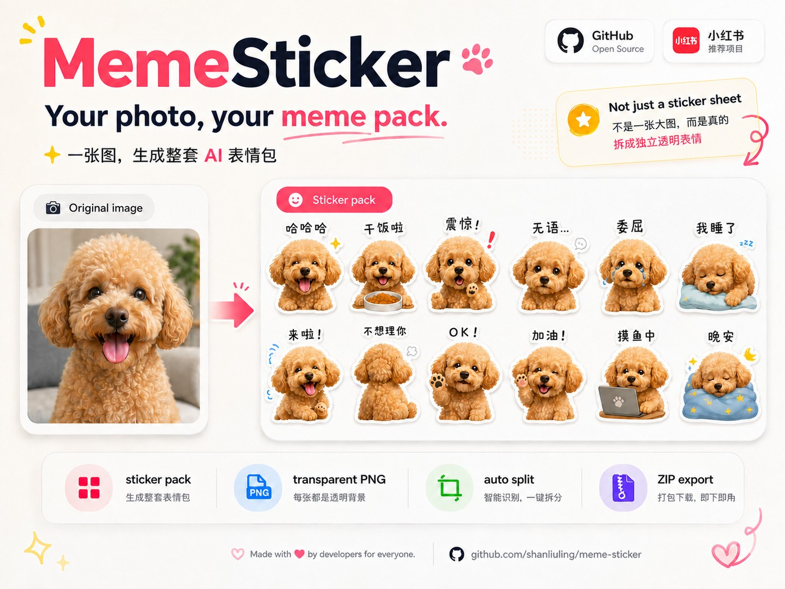

<div align="center">

# MemeSticker 🐾

<p>
  <a href="./assets/sticker-ok-selfie.png"></a>
  <a href="./assets/sticker-ok-cat.png"></a>
  <a href="./assets/sticker-nice-character.png"></a>
</p>

### 一张图 → 一整套 AI 表情包。

**宠物、自拍、角色、玩偶，几乎任何主体都能变成一整套聊天表情。**

**MemeSticker 不是绑定某个固定模型的表情包功能，而是一个可以安装到任意 Agent 中的开源 Skill。**

只要宿主支持 Skills + 图片生成 / 编辑能力，就可以把一张素材图直接变成完整表情包。

⚡ **一次生图生成整套表情**  
💰 **比逐张生成更省生图额度**  
✂️ **自动拆分每一张表情**  
🪄 **自动去背景并输出透明 PNG**  
📦 **最终生成预览图 + `sticker-pack.zip`**

[](https://github.com/shanliuling/meme-sticker/stargazers)
[](./LICENSE)
[](https://www.python.org/)

[English](./README.md) · **简体中文**

<br/>



</div>

---

## ✨ 为什么是 MemeSticker？

很多 AI 表情包工具是一张一张生成，MemeSticker 走的是另一条路线：

```text
1 张素材图
    ↓
1 次生图调用
    ↓
生成完整表情包大图
    ↓
自动拆图 + 自动去背景
    ↓
输出多张独立透明 PNG
```

这样做更快，也更适合自动化，同时能明显减少逐张生成带来的生图额度消耗。

### 不绑定某个模型或平台

MemeSticker 是一个 Skill，而不是某个固定模型自带的表情包功能。只要 Agent 宿主支持 Skills 和图片生成 / 编辑能力，就可以复用同一套表情包工作流，不需要围绕某一个模型或聊天产品重新做一遍。

### 一次生成整套

不需要为每一张表情分别调用一次生图模型。MemeSticker 会先让图片模型一次生成完整表情包，再在本地完成后续处理。

### 自动完成后处理

生成完成后，MemeSticker 会自动拆分表情、去除背景，并输出独立透明 PNG，同时生成预览图和 ZIP 压缩包。

---

## 🎬 实际效果

<p align="center">
  <a href="./assets/example-girl.jpg"></a>
  <a href="./assets/example-cat.jpg"></a>
  <a href="./assets/example-character.jpg"></a>
</p>

<div align="center">

**自拍 · 宠物 · 二次元 / 游戏角色 · 玩偶 · 吉祥物 · 物体**

**表情文案会跟随你的语言。**

</div>

---

## ⚡ 安装和使用

```bash
npx skills add shanliuling/meme-sticker
```

安装后上传一张图片，然后直接说：

> **把这张图做成一套表情包。**

也可以加上你想要的主题：

> 把这只猫做成一套打工人表情包。

> 给这个角色做一套阴阳怪气的聊天表情。

成品包含一张预览图和 `sticker-pack.zip`；压缩包内是多张独立透明 PNG 表情。

> [!IMPORTANT]
> 宿主必须支持 Skills + 图片生成或图片编辑，并提供 Python 3.10+。首次运行可能需要安装 NumPy 和 Pillow。

> [!NOTE]
> 角色一致性、生成文字和复杂背景的处理效果取决于宿主使用的图片模型；导入微信、QQ 或 Telegram 等平台需自行完成。

## 📄 License

MIT © 2026 shanliuling
