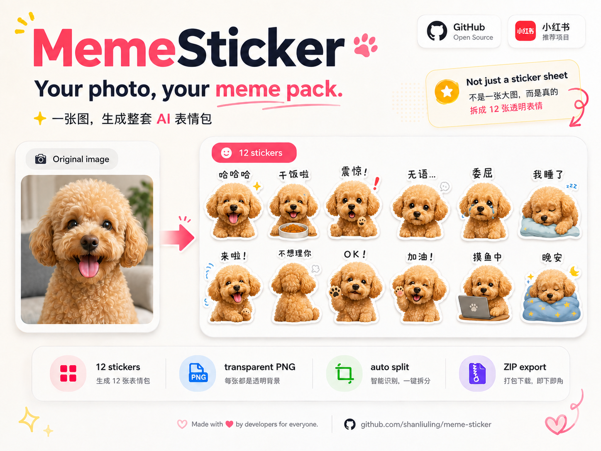
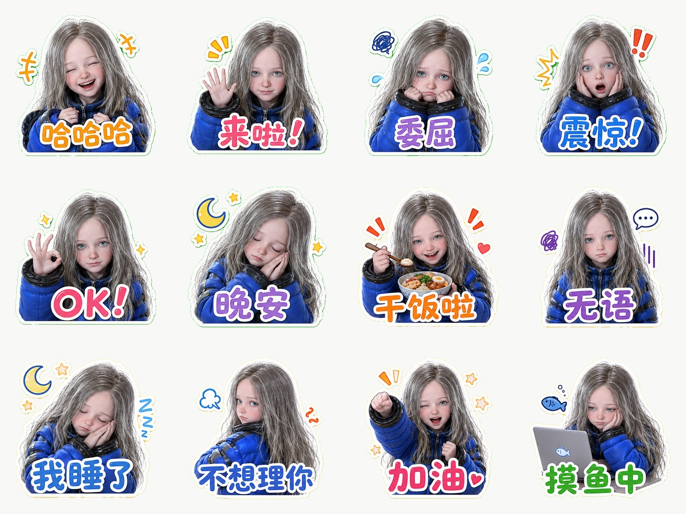
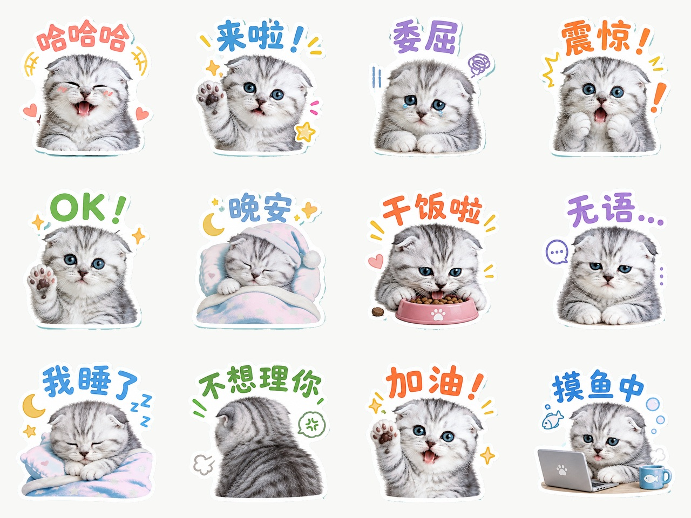
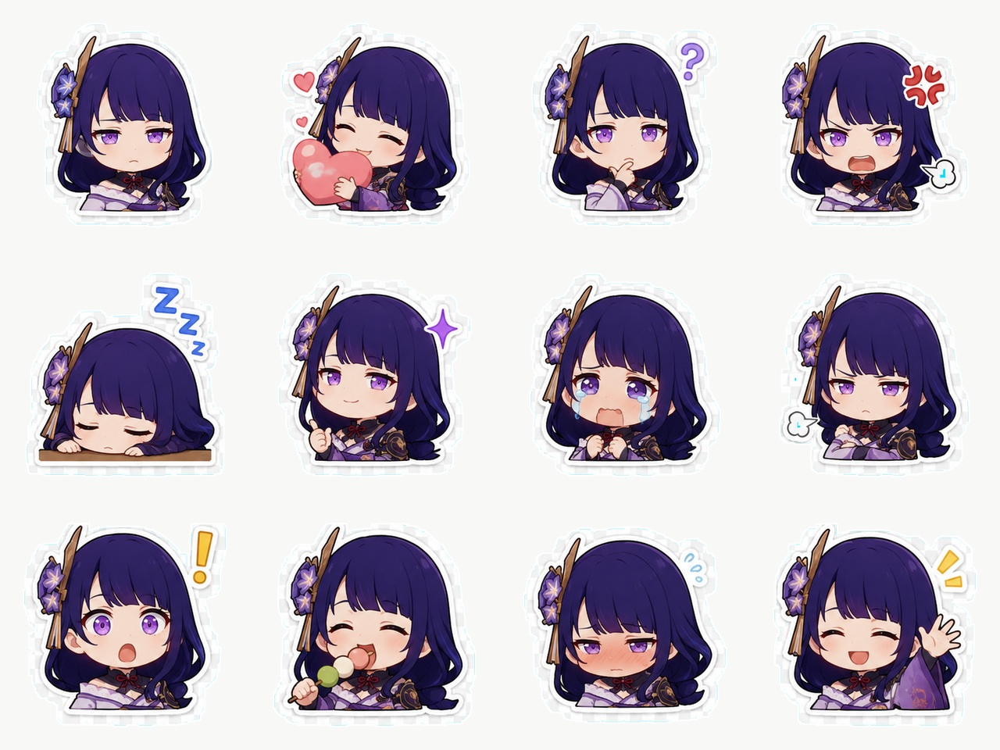

<div align="center">

# MemeSticker 🐾

### 一张图进去，12 张能用的表情包出来。

**宠物、自拍、角色、玩偶，几乎任何主体都能变成一整套 AI 聊天表情。**

One image in, 12 usable stickers out.

[](https://github.com/shanliuling/meme-sticker/stargazers)
[](./LICENSE)
[](https://www.python.org/)

[English](./README.md) · **简体中文**

<br/>



</div>

---

## 🎬 实际效果

<p align="center">
  <a href="./assets/example-girl.jpg"></a>
  <a href="./assets/example-cat.jpg"></a>
  <a href="./assets/example-character.jpg"></a>
</p>

<div align="center">

**自拍 · 宠物 · 二次元 / 游戏角色 · 玩偶 · 吉祥物 · 物体**

</div>

---

## ⚡ 安装和使用

```bash
npx skills add shanliuling/meme-sticker
```

安装后上传一张图片，然后直接说：

> **把这张图做成一套表情包。**

也可以加上你想要的主题：

> 把这只猫做成一套打工人表情包。

> 给这个角色做 12 张阴阳怪气的聊天表情。

成品包含一张预览图和 `sticker-pack.zip`；压缩包内是 12 张独立透明 PNG。

> [!IMPORTANT]
> 宿主必须支持图片生成或图片编辑，并提供 Python 3.10+。首次运行可能需要安装 NumPy 和 Pillow。

> [!NOTE]
> 角色一致性、生成文字和复杂背景的处理效果取决于宿主使用的图片模型；导入微信、QQ 或 Telegram 等平台需自行完成。

## 📄 License

MIT © 2026 shanliuling
